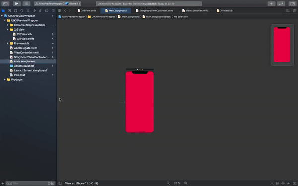

# UIKitPreviewWrapper
There is a way to demonstrate a preview of view or viewControllers no matter if it was written in-code or by using xib files

## How to:

Go to `scripts` and run command `./updateUIPreviewSnippets.bash`

Now there are templates of files to create and code snippets to add previews for already existed views and viewcontrollers.

### To find new templates:
1. File -> New -> File 
2. scroll down to **UI Preview Supported Templates**
3. Choose your own template depending on what's your way for ui crafting

### To add existed previews for already existed elements:
⚠️ **Warning**: if your xcode is open, close it by `command + Q` shortcut and then reopen

1. Use  *Shift + command + L* shortcut to open snippets screen
2. Choose your own template depending on what's your way for ui crafting
